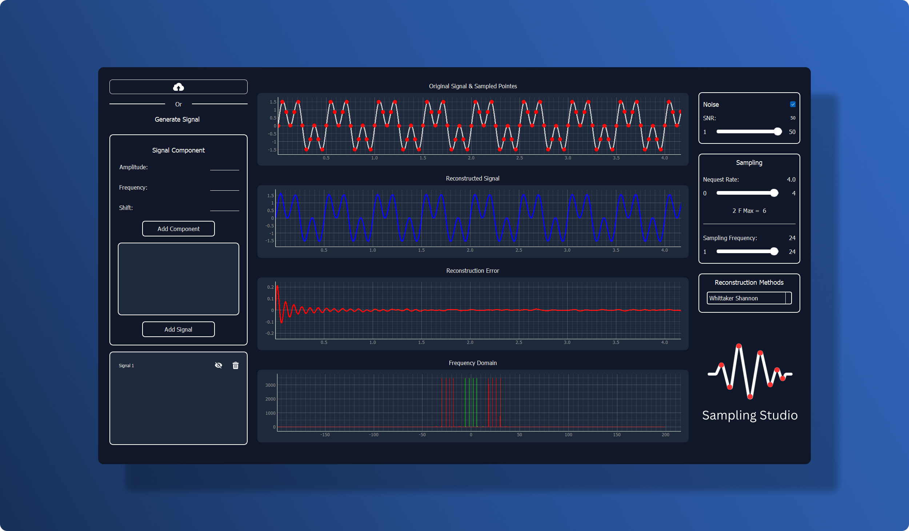

# Sampling-Theory Studio

## Overview
This project is a desktop application developed to demonstrate the principles of signal sampling and recovery based on the Nyquist–Shannon sampling theorem. It helps users visualize, sample, and reconstruct signals using various methods, showcasing the impact of sampling frequency and noise on signal recovery.

---

## Features
1. **Signal Sampling and Recovery**:
   - Load a signal (from a file or generated in-app) and visualize it.
   - Sample the signal at different frequencies (normalized or actual).
   - Recover the original signal using various reconstruction methods like Whittaker–Shannon interpolation.

2. **Signal Mixer/Composer**:
   - Combine sinusoidal signals of different frequencies and amplitudes.
   - Add or remove components dynamically.

3. **Noise Addition**:
   - Add controllable noise to the signal with a customizable SNR.
   - Visualize the effect of noise on signal frequency.

4. **Real-Time Interaction**:
   - Changes in sampling frequency and reconstruction methods update the visualization in real time.

5. **Reconstruction Methods**:
   - Explore multiple reconstruction techniques, including Whittaker–Shannon and alternatives, via a dropdown menu.

6. **Multiple Graphs**:
   - View the original signal, reconstructed signal, error (difference), and frequency domain in a convenient layout.

7. **Responsive UI**:
   - The application adjusts dynamically to resizing without disrupting the interface.

8. **Testing Scenarios**:
   - Includes test cases demonstrating scenarios like aliasing and signal reconstruction challenges.

---

## Setup Instructions
#### Clone the repository
```bash
git clone https://github.com/Mostafaali3/DSP-Sampling-Studio.git
```
#### Navigate to project directory
```bash
cd DSP-Sampling-Studio.git
```

#### Install required packages
```bash
pip install -r requirements.txt
```

#### Run the application
```bash
python main.py
```
